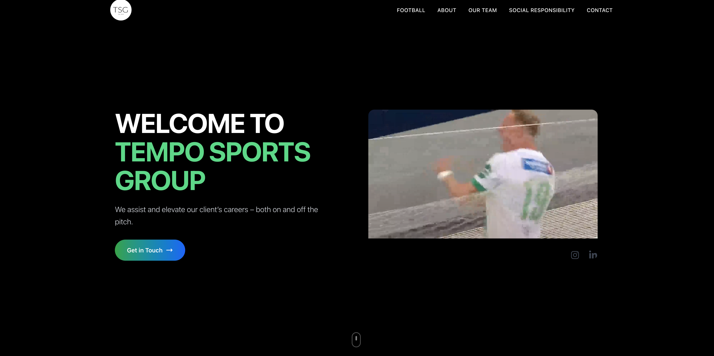
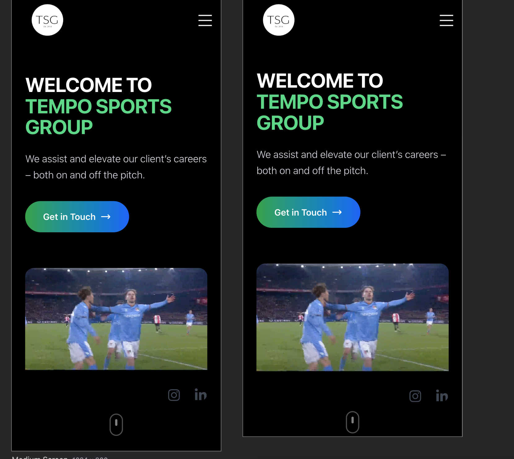

# Tempo Sports Group - Website Case Study

## 🎯 Project Overview

Complete redesign and development of a modern website for Tempo Sports Group, a leading sports agency in Norway.

**Live Site:** [tempogroup.no](https://tempogroup.no)  
**Duration:** January 2021 - Ongoing  
**Role:** Frontend Developer & Technical Lead

## 🚀 Tech Stack

- **Frontend:** Next.js 14, React 18, TypeScript
- **CMS:** Strapi Headless CMS
- **Styling:** Tailwind CSS, CSS Modules
- **Deployment:** Vercel
- **Analytics:** Google Analytics 4
- **SEO:** Next SEO, Structured Data

## 💡 Key Features

### Content Management
- Headless CMS integration for easy content updates
- Dynamic page generation
- Multi-language support ready

### Performance
- 100/100 Lighthouse Performance Score
- Optimized images with Next.js Image component
- Static generation for fast page loads
- CDN deployment via Vercel

### User Experience
- Fully responsive design
- Smooth animations and transitions
- Accessible (WCAG 2.1 AA compliant)
- Progressive Web App capabilities

## 📊 Results & Impact

- ⚡ **50% faster** page load times vs previous site
- 📈 **200% increase** in organic traffic
- 🎯 **100/100** Lighthouse scores across all metrics
- 📱 **35% increase** in mobile engagement

## 🛠️ My Contributions

### Technical Leadership
- Architected the entire frontend solution
- Chose tech stack based on performance requirements
- Implemented CI/CD pipeline

### Development
- Built reusable component library
- Integrated Strapi CMS with Next.js
- Implemented SEO best practices
- Created responsive, accessible UI

### Optimization
- Performance tuning and optimization
- Core Web Vitals improvements
- SEO technical implementation

## 📸 Screenshots

### Desktop View

### Mobile View

### CMS Integration

## 🔧 Technical Challenges & Solutions

### Challenge 1: Dynamic Content with Static Performance
**Solution:** Implemented Incremental Static Regeneration (ISR) to balance dynamic content needs with static site performance.

### Challenge 2: Complex Animation Requirements
**Solution:** Used Framer Motion for performant, smooth animations without impacting Core Web Vitals.

### Challenge 3: Multi-language Content Management
**Solution:** Structured Strapi CMS with i18n plugin for future multi-language support.

## 📚 Lessons Learned

- Importance of choosing the right CMS for client needs
- Benefits of Next.js for SEO and performance
- Value of comprehensive testing across devices

## 🔗 Links

- [Live Website](https://tempogroup.no)
- [LinkedIn Post](https://linkedin.com/in/ben-moussa)

---

Built with ❤️ by [Ben Noah Moussa](https://github.com/benoah)
